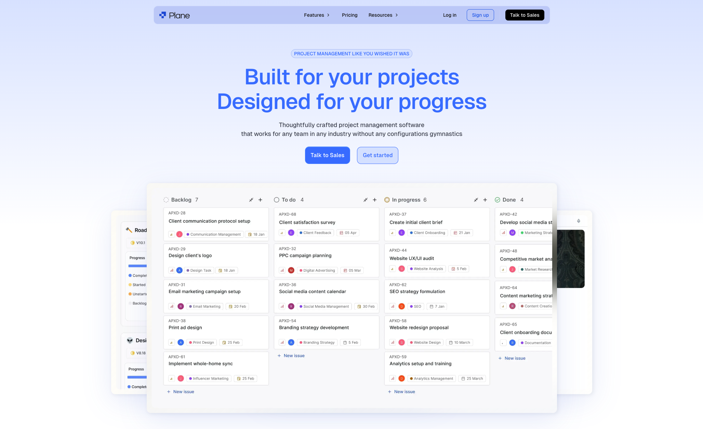
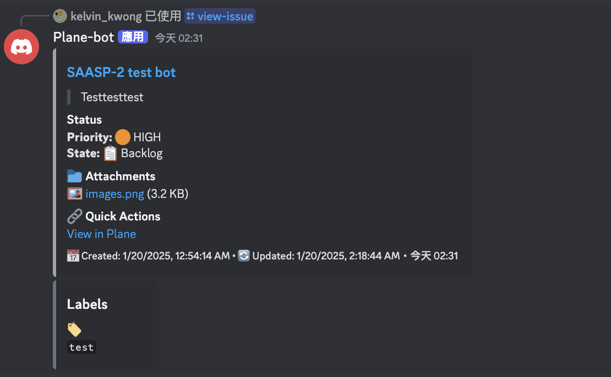
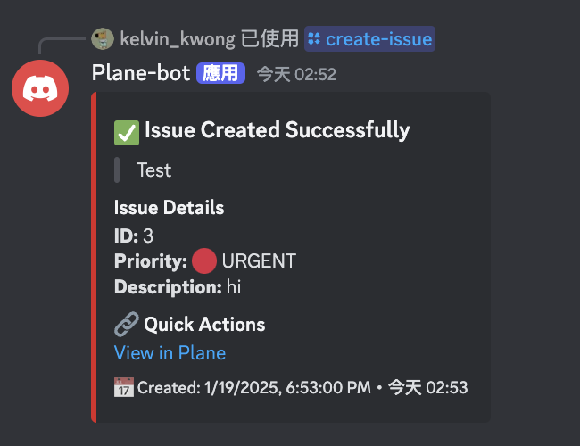
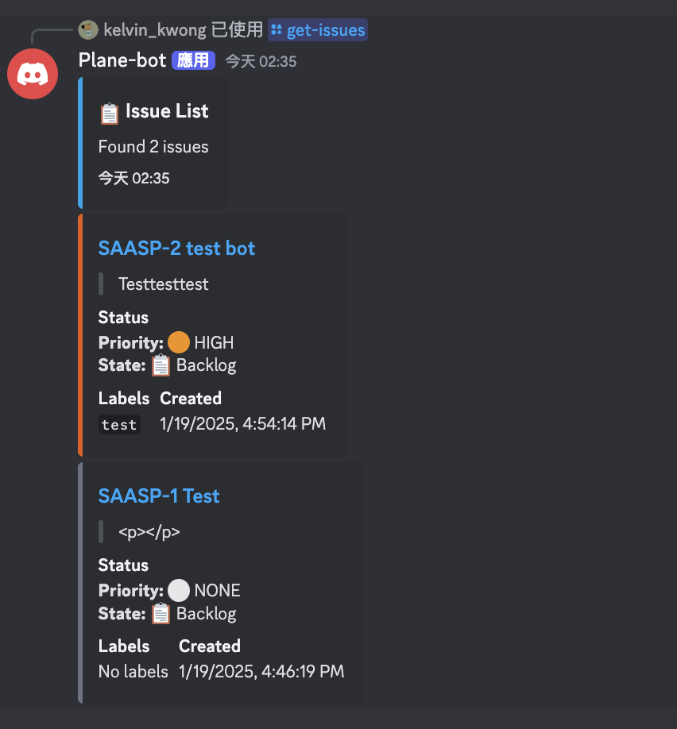

# Plane Discord Bot

A Discord bot that integrates with [Plane](https://plane.so), an open-source project planning tool. This bot allows you to manage Plane issues directly from Discord with rich visual embeds and interactive features.


## Plane Interface



The bot integrates with Plane's modern and intuitive interface, allowing you to manage your projects seamlessly between Discord and Plane's web interface. Above is an example of Plane's project management view, showcasing its clean design and powerful features.

## Features

- **Multi-Channel Support**: Configure different channels to connect to different Plane workspaces/projects
- Create new issues with title, description, and priority
- List issues with filtering by state and priority
- View detailed issue information with rich embeds
- Upload files to existing issues
- Color-coded priority levels (🔴 Urgent, 🟠 High, 🟡 Medium, 🟢 Low)
- Support for issue labels and attachments
- Automatic state tracking with visual indicators
- Beautiful Discord embeds with formatted descriptions
- Direct integration with Plane's API
- Flexible storage options (JSON file or SQLite)

## Prerequisites

- Node.js v16.9.0 or higher
- A Discord bot token and application
- A [Plane](https://plane.so) account with API access
  - Workspace(s) created
  - Project(s) set up
  - API key generated

## Quick Start

1. Clone the repository

```bash
git clone <repository-url>
cd plane-discord-bot
```

2. Install dependencies

```bash
npm install
```

3. Configure environment variables
   Create a `.env` file in the root directory:

```env
# Required
DISCORD_TOKEN=your_discord_bot_token
CLIENT_ID=your_discord_client_id
PLANE_API_KEY=your_plane_api_key

# Optional: Storage configuration
STORAGE_TYPE=json    # "json" (default) or "sqlite"
```

4. Deploy slash commands

```bash
npm run deploy
```

5. Start the bot

```bash
npm start
```

6. Configure channels (in Discord, as server admin)

```
/plane-setup workspace:your-workspace project:your-project-id
```

## Multi-Channel Configuration

The bot supports connecting different Discord channels to different Plane workspaces and projects. This allows teams to:

- Use one bot across multiple projects
- Have dedicated channels for different workspaces
- Manage multiple Plane instances from a single Discord server

> **Important:** Issue commands (`/create-issue`, `/get-issues`, `/view-issue`, `/upload-file`) will only work in channels that have been configured with `/plane-setup`. Unconfigured channels will show a "Channel Not Configured" message prompting an admin to run the setup command.

### Admin Commands

| Command | Description | Permission |
|---------|-------------|------------|
| `/plane-setup` | Configure a channel with workspace and project | Admin only |
| `/plane-config` | View current channel's configuration | Everyone |
| `/plane-remove` | Remove configuration from a channel | Admin only |
| `/plane-list` | List all configured channels in the server | Admin only |

### Setup Example

```
# In #frontend-bugs channel
/plane-setup workspace:acme-corp project:frontend-project-id

# In #backend-bugs channel
/plane-setup workspace:acme-corp project:backend-project-id

# In #mobile-team channel (different workspace)
/plane-setup workspace:mobile-division project:ios-app-id
```

## Interface Examples

### View Issue Command



```
/view-issue
Shows issue details with:
• Title and ID
• Priority with color indicators (🔴 HIGH, 🟠 MEDIUM, etc.)
• State with icons (📋 Backlog, ✅ Done, etc.)
• Attachments with previews
• Labels
• Creation and update timestamps
```

### Create Issue Command



```
/create-issue
Create new issues with:
• Title and description
• Priority selection with visual indicators (🔴 Urgent, 🟠 High, 🟡 Medium, 🟢 Low)
• Rich success embed showing:
  - Issue ID and title
  - Priority color coding
  - Creation timestamp
  - Direct link to the created issue
• Error handling with clear feedback
```

### Get Issues Command



```
/get-issues
Lists issues with:
• Summary of total issues found
• Individual issue cards
• Priority and state indicators
• Labels and timestamps
• Quick links to Plane
```

## Commands

### Issue Commands

#### `/create-issue`

Create a new issue in Plane.

**Options:**

- `title` (required): The title of the issue
- `description` (optional): The description of the issue
- `priority` (optional): The priority level (Urgent, High, Medium, Low)

**Example:**

```
/create-issue title: Fix login bug description: Users can't login with Google priority: high
```

#### `/view-issue`

View detailed information about a specific issue.

**Options:**

- `id` (required): The sequence ID of the issue (e.g., PROJ-123)

**Example:**

```
/view-issue id: PROJ-123
```

#### `/get-issues`

Get a list of issues with optional filters.

**Options:**

- `state` (optional): Filter by state (Backlog, Unstarted, Started, Completed, Cancelled)
- `priority` (optional): Filter by priority (Urgent, High, Medium, Low)

**Example:**

```
/get-issues state: started priority: high
```

#### `/upload-file`

Upload a file to an existing issue.

**Options:**

- `id` (required): The sequence ID of the issue (e.g., PROJ-123)
- `file` (required): The file to upload (max 10MB)

**Example:**

```
/upload-file id: PROJ-123 file: screenshot.png
```

Supported file types:

- Images: png, jpg, jpeg, gif, bmp, webp
- Documents: pdf, doc, docx, xls, xlsx, ppt, pptx, txt, rtf
- Archives: zip, rar, 7z, tar, gz
- Code: js, jsx, ts, tsx, py, java, cpp, cs, html, css
- Other: md, json, xml, yaml, yml

### Configuration Commands

#### `/plane-setup`

Configure the current channel to use a specific Plane workspace and project. **Admin only.**

**Options:**

- `workspace` (required): The Plane workspace slug
- `project` (required): The Plane project ID

**Example:**

```
/plane-setup workspace: acme-corp project: proj_abc123
```

#### `/plane-config`

View the current Plane configuration for this channel.

**Example:**

```
/plane-config
```

#### `/plane-remove`

Remove the Plane configuration from this channel. **Admin only.**

**Example:**

```
/plane-remove
```

#### `/plane-list`

List all configured channels in this server. **Admin only.**

**Example:**

```
/plane-list
```

## Visual Features

- Priority-based color coding:

  - Urgent: Bright Red (#DC2626)
  - High: Bright Orange (#EA580C)
  - Medium: Golden Yellow (#CA8A04)
  - Low: Green (#16A34A)
  - None: Gray (#6B7280)

- Rich embeds with:
  - Issue title and ID
  - Formatted description
  - State information with Plane's workflow states
  - Priority level
  - Labels
  - Creation date
  - Direct link to Plane issue
  - Attachment information

## Storage Options

The bot supports two storage backends for channel configurations:

### JSON Storage (Default)

- No additional dependencies required
- Stores data in `./data/channels.json`
- Good for small deployments

### SQLite Storage

- Requires `better-sqlite3` package
- Stores data in `./data/channels.db`
- Better for larger deployments with many channels

To use SQLite:

```bash
npm install better-sqlite3
```

Then set in `.env`:

```env
STORAGE_TYPE=sqlite
```

## Environment Variables

Create a `.env` file in the root directory with the following configuration:

```env
# Discord Bot Configuration
DISCORD_TOKEN=your_discord_bot_token    # Your Discord bot token from Discord Developer Portal
CLIENT_ID=your_discord_client_id        # Your Discord application client ID

# Plane Configuration
PLANE_API_KEY=your_plane_api_key        # Your Plane API key from Settings > API Tokens

# Storage Configuration (optional)
STORAGE_TYPE=json                       # Storage backend: "json" (default) or "sqlite"
# STORAGE_PATH=./data                   # Optional: custom path for storage file

# Logging Configuration (optional)
LOG_LEVEL=info                          # Logging level: debug, info, warn, error
ENABLE_FILE_LOGS=false                  # Enable logging to files: true/false
```

### Where to Find the Values

#### Discord Configuration

1. Go to [Discord Developer Portal](https://discord.com/developers/applications)
2. Create or select your application
3. `CLIENT_ID`: Found in OAuth2 > General
4. `DISCORD_TOKEN`: Found in Bot > Token (Reset Token if needed)

#### Plane Configuration

1. `PLANE_API_KEY`: Generate from Settings > API Tokens
2. `WORKSPACE_SLUG`: The identifier in your Plane workspace URL
   - Example: `https://app.plane.so/YOUR-WORKSPACE-SLUG/...`
3. `PROJECT_ID`: Found in Project Settings > General

## Development

For development with hot-reloading:

```bash
npm run dev
```

## Docker Support

Build the container:

```bash
docker build -t plane-discord-bot .
```

Run with Docker:

```bash
docker run -d \
  --name plane-bot \
  --restart unless-stopped \
  -e DISCORD_TOKEN=your_discord_token \
  -e PLANE_API_KEY=your_plane_api_key \
  -e CLIENT_ID=your_discord_client_id \
  -v ./data:/app/data \
  plane-discord-bot
```

Note: Mount a volume for `/app/data` to persist channel configurations.

## Contributing

1. Fork the repository
2. Create your feature branch (`git checkout -b feature/amazing-feature`)
3. Commit your changes (`git commit -m 'Add some amazing feature'`)
4. Push to the branch (`git push origin feature/amazing-feature`)
5. Open a Pull Request

## License

This project is licensed under the MIT License - see the [LICENSE](LICENSE) file for details.

## Links

- [Plane Website](https://plane.so)
- [Plane API Documentation](https://developers.plane.so)
- [Discord.js Documentation](https://discord.js.org)
